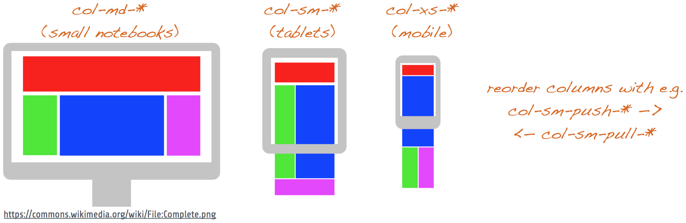

# Bootstrap CSS Basics

# Exercise for this step

* implement the layout above for desktop, tablet and mobile view
* use CSS background colors to identify the according components
* play around with forms, buttons, alerts, icons, ...
* more information to get started
    + https://www.w3schools.com/bootstrap/bootstrap_get_started.asp
    + https://getbootstrap.com/docs/3.3/components/
* **Hint:** Start modelling for **mobile viewport first** (`col-xs-*`)